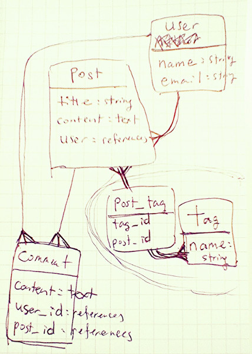

# Scribble

#### Planning the database structure using ERD

```
user:
  - name: string
  - email: string
post:
  - title: string
  - content: text
  - user: references
  - (tag: post_tag_id)
comment:
  - content: text
  - user: references
  - post: references
tag:
  - name: string
  - (post: post_tag_id)
posts_tags(join table):
  - tag_id
  - post_id
```




#### Generate models and migration files (database schema)

- [docs](http://guides.rubyonrails.org/command_line.html#rails-generate)
- `rails generate model NAME [field[:type][:index] field[:type]`

```
rails g model post title:string content:text user:references
rails g model comment content:text user:references post:references
```

```
rails g model post title:string content:text user:references
rails g model comment content:text user:references post:references
```

#### Generate controllers

```
rails g controller Posts index show new create edit update destroy
rails g controller Comments new create
```

#### Some gems used

- [devise](https://github.com/plataformatec/devise)
  + Follow the [docs](http://devise.plataformatec.com.br/)

```
$ rails generate devise:install
$ rails generate devise User
$ rails generate devise:views
$ rails db:migrate
```

#### Slim syntax for multiple attributes

- [ key="value", key="value" ]
- Attributes are separated by space.

```slim
button.close[aria-hidden="true" data-dismiss="alert" type="button"]
  | ×
```

#### [Create a username field in the users table](https://github.com/plataformatec/devise/wiki/How-To%3a-Allow-users-to-sign-in-using-their-username-or-email-address#create-a-username-field-in-the-users-table)

#### many-to-many relationship in Rails (two ways)

- `has_and_belongs_to_many`
  + Generate the join table in the database, but there wont be a generated model for the join.
  + So, you won’t be able to add validations or any other attributes to the join.

- `has_many, through`
  + Requires a model to be created for the join table.
  + This way is preferred for most cases.

#### [h method for html escape](http://stackoverflow.com/a/296751/3837223)

- Converts things like < and > into numerical character references so that rendering won't break your html.

---

## Troubleshooting

#### [ActiveRecord::ConnectionAdapters::PostgreSQLColumn#number? has been removed in rails 5 #1341](https://github.com/plataformatec/simple_form/issues/1341)

```rb
gem 'simple_form', github: 'kesha-antonov/simple_form', branch: 'rails-5-0'
```

#### [Error when trying to run rspec: `require': cannot load such file...](http://stackoverflow.com/a/25804049/3837223)

`rails generate rspec:install`

---

## References

- [WDI-DC's demo app](https://wdi-scribble.herokuapp.com)
- [mnishiguchi/musicians_rails](https://github.com/mnishiguchi/musicians_rails)
- [mnishiguchi/moving_estimator](https://github.com/mnishiguchi/moving_estimator)
- [tagging-scratch-rails](https://www.sitepoint.com/tagging-scratch-rails/)
